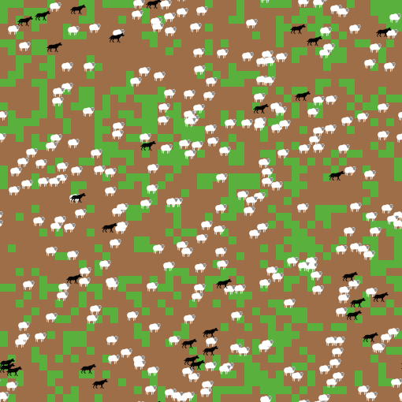

## Reinforcement Learning Using Q-Learning in a Predator/Prey Agent-Based Model with NetLogo and PyTorch 

Agent-based modeling is way of designing computational models from the perspective of individual autonomous agents to study how the behavior of systems as a whole are determined by the interactions between agents and other elements of the system.

[NetLogo](https://ccl.northwestern.edu/netlogo/) is a programming language and modeling environment created and maintained by the [CCL Lab](https://ccl.northwestern.edu/) at [Northwestern University](http://www.northwestern.edu/).

Predator/Prey systems are an ecological phenomenon that can be easily modeled using agent-based modeling (ABM.)




You can use the [editor on GitHub](https://github.com/Loafie/q-learning-and-mice-abm/edit/gh-pages/index.md) to maintain and preview the content for your website in Markdown files.

Whenever you commit to this repository, GitHub Pages will run [Jekyll](https://jekyllrb.com/) to rebuild the pages in your site, from the content in your Markdown files.

### Markdown

Markdown is a lightweight and easy-to-use syntax for styling your writing. It includes conventions for

```markdown
Syntax highlighted code block

# Header 1
## Header 2
### Header 3

- Bulleted
- List

1. Numbered
2. List

**Bold** and _Italic_ and `Code` text

[Link](url) and 
```

For more details see [GitHub Flavored Markdown](https://guides.github.com/features/mastering-markdown/).

### Jekyll Themes

Your Pages site will use the layout and styles from the Jekyll theme you have selected in your [repository settings](https://github.com/Loafie/q-learning-and-mice-abm/settings). The name of this theme is saved in the Jekyll `_config.yml` configuration file.

### Support or Contact

Having trouble with Pages? Check out our [documentation](https://docs.github.com/categories/github-pages-basics/) or [contact support](https://github.com/contact) and we’ll help you sort it out.
