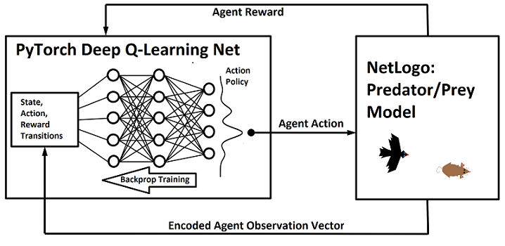
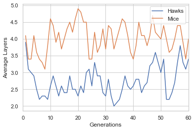
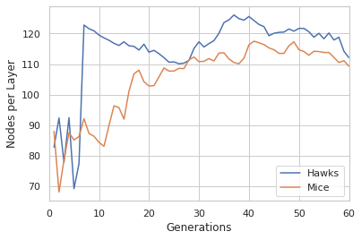
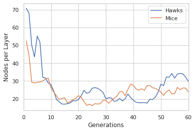

## Evolving Metaparameters of Deep Q-Learning Agents in a Predator/Prey Agent-Based Model

__[Can Gurkan](mailto:gurkan@u.northwestern.edu) and [Leif Rasmussen](mailto:leifr@u.northwestern.edu)__

__COMP_SCI 496 Deep Learning - Brian Pardo__

 _Northwestern University_

### Introduction

The aim of this project is to embedded reinforcement learning models into predator and prey agents in an agent-based model with evolutionary dynamics that effect the meta-parameters of the learning models. Agent-based modeling is way of designing computational models from the perspective of individual autonomous agents to study how the behavior of systems as a whole are determined by the interactions between agents and other elements of the system. [NetLogo](https://ccl.northwestern.edu/netlogo/) is a programming language and agent-based modeling environment that we rely heavily on in this work. It was created and maintained by the [CCL Lab](https://ccl.northwestern.edu/) at [Northwestern University](http://www.northwestern.edu/). NetLogo includes a Python extension which allows us to interact with external Python code from within a NetLogo model-and more importantly to use machine learning libraries such as PyTorch. We have created a few different NetLogo models and a Q-learning model in PyTorch that we use in this project to conduct our experiments.

__The [paper](http://link) also linked above describes the conceptual motivation for this project in more depth.__

The main experiment we conducted using the software we built was to create an agent-based model in which agents with deep q-learning nets embedded in them would compete in rounds of predator/prey games. Initial agents would be created with random meta-parameters for their deep q-learning nets and at the end of each round (generation) the agents that performed the best would pass on their meta-parameters with some noise (mutation) to the next generation of deep q-learning agents who would then repeat the process. We also incurred some additional penalty to the agents' scores at the end of each round based on the number of parameters in their deep q-nets and the size of their batch memory. Through this process we were able to observe evolutionary optimization of the meta-parameters.
 
### NetLogo Models

We used a single agent ABM to calibrate our reinforcement learning model. A single mouse agent is placed in an environment with a fixed number of randomly placed fruit and poison vials. The agent gets a positive reward for landing on fruit and a negative reward for landing on poison. In each time step the agent can choose to turn right or left by 20 degrees or move forward.

The following is a demonstration, but just with a manually programmed agent heuristic.

__Press the _setup_ and then the _go_ button.__

<iframe src="dummy-model-demo.html" width="100%" height="100%" style="border:none; margin-top:-150px;" scrolling="no"></iframe>

The second model we used involved multiple predator and prey agents. The hawk agents and the mice agents can both perform only 3 actions as in the prior model: turn right or left by 20 degrees and move forward. The hawks receive a positive reward when they get within a certain distance of a mouse. Mice receive a negative reward when they get too close to a hawk and then are moved to a new random location in the world.

Below is a demonstration that in which mice and hawks act purely randomly.

__Press the _setup_ and then the _go_ button.__

<iframe src="pred-prey-dummy-demo.html" width="100%" height="100%" style="border:none; margin-top: -150px;" scrolling="no"></iframe>

### Reinforcement Learning Models

To embed reinforcement learning into the agents in our ABMs we designed an Agent class in Python that we access from NetLogo with the NetLogo Python Extension. In fact, we developed a number of different Agent classes to experiment with different styles of reinforcement learning. However, all of these variations centered around one method of reinforcement learning: Q-learning.

#### Q-Learning

In Q-learning we try to find a state-action value function for an agent. The state-action value function gives us a value for performing each action in the set of possible actions available to the agent given a state. The agent's policy can then be determined by choosing an action in a given state based on the values of the state-action function. We can do this deterministically (always choosing the maximum valued action) or probabilistically (choose an action with a probability proportional to its value.) In deep q-learning, we train a deep net (ANN) to approximate the state-action value function. We do this by passing reward signals from the agent's environment into the deep learning model.

Our agent's deep neural net is initialized with random values such that that values of the state-action function are initially random as well. Using gradient descent we try to nudge our deep neural net toward approximating a good state-action function for the agent to use to make decisions in the model. We do this by keeping track of state-action-reward transitions made by the agent in each time step. Then we use the following formula as our target Q (state-action function) value and do gradient descent over the error between this target value and the actual value produced by the deep net.

$$Q_{target}(s_{last},a_{last}) = R + \gamma \dot \max_{a \in A} Q_{actual}(s_{current},a)$$

In our Python Agent class, we keep track of a library of state-action-reward transitions that the agent has made throughout its entire history and at each time step do batch-gradient-descent on a randomly selected batch of transitions from the library.

### Encoding the Agent's State

The agents in our model have only a limited amount of local information available to them about the complete state of the model. This is different from a lot of reinforcement learning techniques which tend to use the entire state for training. The [Markov assumption](https://en.wikipedia.org/wiki/Markov_property) made in reinforcement learning does not hold given the way were are encoding our states, but this merely turns the agents perceived world into a probabilistic environment rather than a deterministic one-and so the reinforcement learning techniques we use will still work.

To encode information about the agent's current state, we create a real valued vector which captures the scaled distance of different type of entities within a number of cones of vision fanning out around the agent to a fixed distance.

The model below will demonstrate how an individual agent's state vector is generated based on vision parameters and other entities in its proximity.

__Press the _setup_ and then use the _Agent Action_ buttons to change the agent's state while observing the changes to the State Vector.__

<iframe src="encoding-visualization.html" width="100%" height="100%" style="border:none; margin-top: -150px;" scrolling="no"></iframe>

### Model Meta-Parameters and Evolution

The deep q-nets inside of our agents have a number of different parameters: discounting factor, epsilon-decay (for an epsilon-greedy policy,) number of layers, dimensions of the first layer, dimensions of the secondary layer, training batch size and learning rate. In our primary predator/prey ABM we create 10 mice and 10 hawks with meta-parameters for their deep-nets randomly chosen from a given distribution. These 10 agents play the predator/prey game for a set amount of time-steps. Mice are given negative rewards and scored negatively for being captured by hawks. Hawks are given positive rewards and scores for capturing mice. At the end of the round the hawks and mice with the best scores pass on their meta-parameters to the next generation. The first place passes on their meta-parameters to four in the next generation, the second place, three, the third place, two, and the fourth place, one. The scores are also scaled by the number of parameters in the agents' deep q-learning nets, with larger nets resulting in a lower score. This introduces a downward selective pressure on net-size.

### Results

The following are results from a run of the model over 60 generations:

_We just show the evolution of the average number of layers in each type of agents' deep Q-net and the average dimensions of primary and secondary layers. For more detailed results see the [paper]()._

  

### Future Work

We hope to use some portion of the software we developed and some of the experimental techniques in this project in future work. We would like to put q-learning agents in more complex environments with larger state and action spaces and less computational tractable equilibria. All of the experiments we conduct in this project were done on small scale hardware as well. In the future we would like to be able to throw more computing power at something like this so we can conduct a wider range of experiments and get more robust results.
